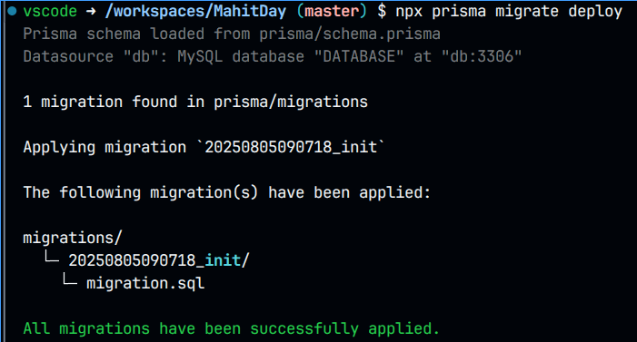

# MahitdayQuiz Registration Website v2

A web application for MahitdayQuiz registration and announcements

Successor of [docchula/amsci-website](https://github.com/docchula/MahitdayQuiz), created by [Sarun Intaralawan](https://github.com/sarunint). Based on [Angular](https://angular.dev/).

## Getting started on development

One simple way to get started with the development is to use VSCode's Dev Container feature.

1. Follow the instructions to install VSCode with Dev Container: https://code.visualstudio.com/docs/devcontainers/containers#_installation

2. When you open this folder in VSCode, you'll get a prompt on the bottom right side of the screen. Select the **_Reopen in Container_** button.

3. Once the container is opened (which may take a couple of minutes), try to open SQLTools to see the database. At this point, it should be empty.

4. Run the command `npx prisma migrate deploy`

5. Check back into SQLTools and you should see the database being populated with some tables.

### Accessing the app and database

When you run `npm run dev`, a prompt will show you how to open the app on the bottom right side of the screen.

If you'd like to access the database (e.g., using GUI tools such as DBeaver or DataGrip), go to the **_PORTS_** panel (should be a tab on the bottom panel). Then select **_Forward a Port_** (or **_Add Port_**) and enter `3306` as the port number. Then you can connect to the database using `localhost` as the host/IP and `3306` as the port number. The username is `root`, the password is empty (no password), and the database name is `DATABASE`.

### Issues with Dev Containers

In case of issues with the containers, go into the Docker control panel and delete containers with **_mahitday_devcontainer_** in the name.

Alternatively, you can use the "Rebuild" command in VSCode (open the command dialog box with `Ctrl+Shift+P`). It will be named "Rebuild and Reopen" or similar if you're outside the container, and named "Rebuild" or similar if you're inside the container.

If you'd like to reset the database (e.g., in case you've corrupted it), then delete the **_volume_** with the name **_mahitday_devcontainer_mahitday-dev-db_** and rebuild the containers (see above).

## Developers

SMCU developers by generation. Add your name here when you're continuing the legacy!

- MDCU78: Ittipat Thanabodikarn
- MDCU78: Punyawish Patumhirunruksa
